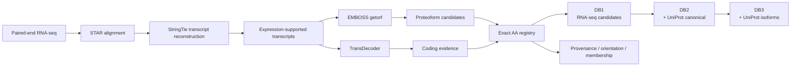

# ProteoGenScope

<p align="center">
  <picture>
    <source media="(prefers-color-scheme: dark)" srcset="assets/branding/proteogenscope-logo-dark.png">
    <source media="(prefers-color-scheme: light)" srcset="assets/branding/proteogenscope-logo-light.png">
    
  </picture>
</p>

<p align="center">
  <strong>Sample-specific proteogenomic search-space construction from RNA-seq evidence.</strong>
</p>

<p align="center">
  
  
  
  
  
</p>

**ProteoGenScope** is a proteogenomic search-space construction framework designed to generate **sample-specific, traceable and non-redundant protein FASTA databases** from RNA-seq evidence and curated reference proteomes.

The framework separates candidate generation from search-space construction: RNA-supported protein candidates are retained with their provenance, collapsed only by exact amino-acid identity, and progressively combined with canonical and isoform reference sequences for downstream proteomics searches.

> **Current public version:** ProteoGenScope **v2** — `proteoform-oriented` profile.

---

## Why ProteoGenScope?

Proteogenomic database construction involves a trade-off between recovering sample-specific sequence diversity and keeping the search space interpretable and computationally manageable. ProteoGenScope addresses this by making the construction rules explicit and auditable.

- **Sample-specific** — RNA-seq evidence is processed independently for each biological sample.
- **Traceable** — every non-redundant sequence retains its source and ORF provenance.
- **Nested** — DB1, DB2 and DB3 allow progressive expansion of the search space.
- **Deterministic** — exact amino-acid identity is tracked with SHA-256 sequence keys.
- **Orientation-aware** — sense and reverse-complement ORFs remain distinguishable after translation.
- **HPC-ready** — the current implementation is designed for SLURM execution.

## Workflow overview



## Proteoform candidate policy

RNA-supported transcripts are translated with EMBOSS `getorf` using:

```text
-find 1        START -> STOP
-minsize 390   minimum 390 nt (~130 aa)
-reverse Y     sense + reverse-complement search
-table 0       standard nuclear genetic code
```

This profile enumerates START-to-STOP ORF candidates of at least **130 amino acids** in both orientations. Orientation is preserved as provenance rather than discarded after translation.

TransDecoder is executed as an **additional coding-evidence branch**. It does not replace EMBOSS candidate generation and is not currently a mandatory filter for DB1 admission.

## Exact sequence non-redundancy

ProteoGenScope does **not** use similarity-based clustering for database collapse.

```text
same complete AA sequence                     -> same sequence entity
substitution / insertion / deletion / length -> distinct sequence entity
```

SHA-256 hashes of normalized amino-acid sequences are used as deterministic internal sequence keys. Multiple ORFs may therefore map to a single physical FASTA entry while retaining all source records in the provenance table.

## Nested search databases

For each sample, ProteoGenScope v2 constructs:

| Database | Definition | Purpose |
|---|---|---|
| **DB1** | `NR(RNA-seq-derived proteoform candidates)` | Sample-specific RNA-derived search space |
| **DB2** | `NR(DB1 + UniProt canonical)` | Adds reviewed canonical reference proteins |
| **DB3** | `NR(DB2 + UniProt isoforms)` | Adds reviewed reference isoforms |

`NR()` denotes exact full-length amino-acid sequence collapse.

## Core outputs

Each sample produces DB1/DB2/DB3 FASTA files plus traceability tables:

| Output | Description |
|---|---|
| `proteoform_registry.tsv` | One record per non-redundant amino-acid sequence |
| `proteoform_provenance.tsv` | ORF/transcript/reference records contributing to each sequence entity |
| `orientation_summary.tsv` | Sense/reverse counts before and after exact sequence collapse |
| `database_summary.tsv` | Database size and sequence-length statistics |
| `db_membership.tsv` | Explicit DB1/DB2/DB3 membership for each PGS accession |
| `duplicate_groups.tsv` | Exact-sequence groups collapsed during non-redundancy |
| `source_summary.tsv` | Contributions from RNA-seq and reference sources |
| `database_manifest.tsv` | Inventory of generated search databases |

ProteoGenScope accessions follow:

```text
<sample_id>_PGS<6-digit integer>
```

For a given sample, the same sequence entity retains the same PGS accession across DB1, DB2 and DB3.

## Validation of the current profile

The v2 proteoform-oriented profile has been executed on three HNSCC RNA-seq samples in the CNPEM Marvin HPC environment.

| Search space | Observed size across the three validation samples |
|---|---:|
| DB1 | ~16.4k–17.8k non-redundant RNA-derived candidates |
| DB2 | ~36.4k–37.7k sequences |
| DB3 | ~58.4k–59.8k sequences |

DB1 candidates had a minimum length of **130 aa** and a mean length of approximately **205 aa**. These values describe the current validation dataset and are not fixed properties of the software.

## Repository layout

```text
MAS-ProteoGenScope/
├── README.md
├── CHANGELOG.md
├── CONTRIBUTING.md
├── LICENSE
├── docs/
│   └── architecture.md
└── v2-proteoforms/
    ├── ProteogenScope_v2_proteoforms.sbatch
    ├── submit_proteogenscope_v2_proteoforms.sh
    ├── build_proteogenscope_proteoforms_v2.py
    ├── validate_proteogenscope_inputs.py
    ├── README.md
    ├── CONVENTION.md
    ├── VERSION
    └── examples/
        ├── samplesheet.example.tsv
        └── metadata.example.tsv
```

## Quick start

Clone the repository:

```bash
git clone https://github.com/cnpem/MAS-ProteoGenScope.git
cd MAS-ProteoGenScope/v2-proteoforms
```

Copy and edit the sanitized templates:

```bash
cp examples/samplesheet.example.tsv samplesheet.tsv
cp examples/metadata.example.tsv metadata.tsv
```

Configure your local reference paths and environment as described in [`v2-proteoforms/README.md`](v2-proteoforms/README.md), then submit:

```bash
bash submit_proteogenscope_v2_proteoforms.sh
```

> The current implementation requires project-specific transcript-filtering, junction-annotation and reporting helper scripts. These dependencies must be configured locally before execution.

## Documentation

- [Proteoform-oriented profile](v2-proteoforms/README.md)
- [Sequence and database conventions](v2-proteoforms/CONVENTION.md)
- [Architecture](docs/architecture.md)
- [Changelog](CHANGELOG.md)
- [Contributing](CONTRIBUTING.md)

## Data policy

Raw sequencing data, generated FASTA databases, sample-level clinical metadata, internal HPC paths and analysis outputs are intentionally **not versioned** in this public repository.

The repository contains source code, conventions and sanitized templates required to reproduce the workflow with user-provided data and infrastructure-specific configuration.

## Versioning

Software versions describe changes to the **ProteoGenScope framework**. Alternative search-space strategies should preferentially be represented as analytical profiles or configuration changes rather than being treated as independent software versions.

## Status

ProteoGenScope v2 is a **development release**. Interfaces, dependency handling and analytical profiles may change as the framework is validated on additional datasets and proteomics search strategies.

## License

ProteoGenScope is distributed under the [MIT License](LICENSE).
