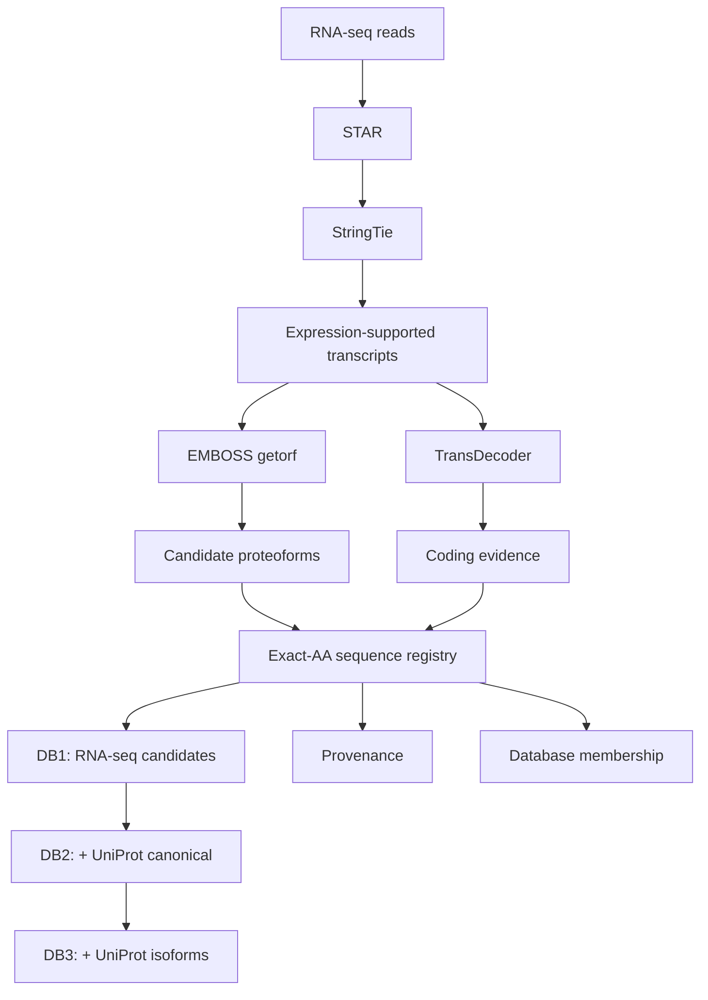

# ProteoGenScope v2 architecture

ProteoGenScope v2 separates RNA-supported candidate generation from the construction of proteomics search databases.

## Data flow



## Layer 1 — RNA-supported transcript reconstruction

The current HPC implementation aligns paired-end RNA-seq reads, reconstructs transcripts and retains expression-supported transcript models prior to translation.

## Layer 2 — candidate proteoform enumeration

The current v2 proteoform profile uses EMBOSS `getorf` with:

```text
-find 1
-minsize 390
-reverse Y
-table 0
```

The resulting candidates are START-to-STOP ORFs of at least ~130 aa from both transcript orientations.

## Layer 3 — coding evidence

TransDecoder is run in parallel as supporting coding evidence. Its output does not currently define the candidate universe and is not a mandatory DB1 filter.

## Layer 4 — exact sequence registry

Normalized amino-acid sequences are keyed by SHA-256. Exact sequence identity defines non-redundancy; no approximate clustering threshold is applied.

This layer separates:

- **sequence identity** — the non-redundant amino-acid entity;
- **provenance** — all RNA-seq/reference records that produced that entity;
- **membership** — the search databases containing that entity.

## Layer 5 — nested database construction

```text
DB1 = NR(RNA-seq-derived proteoform candidates)
DB2 = NR(DB1 + UniProt canonical)
DB3 = NR(DB2 + UniProt isoforms)
```

The nested design supports controlled evaluation of search-space expansion while preserving sample-specific RNA evidence.

## Future search-space control

ProteoGenScope is designed so that additional admission/evidence layers can be inserted between candidate enumeration and final database construction. Planned directions include protease-aware and acquisition-aware evidence for bottom-up and middle-down proteomics.
